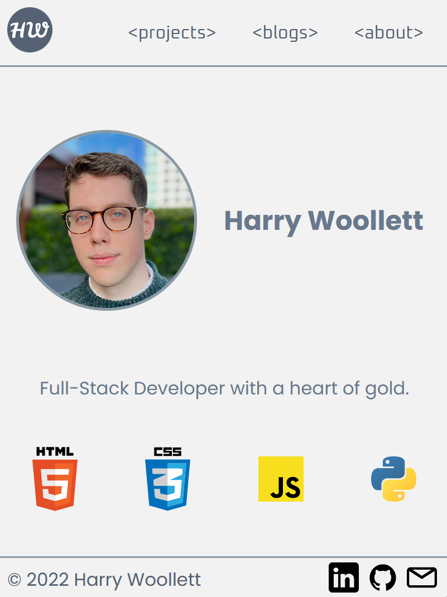
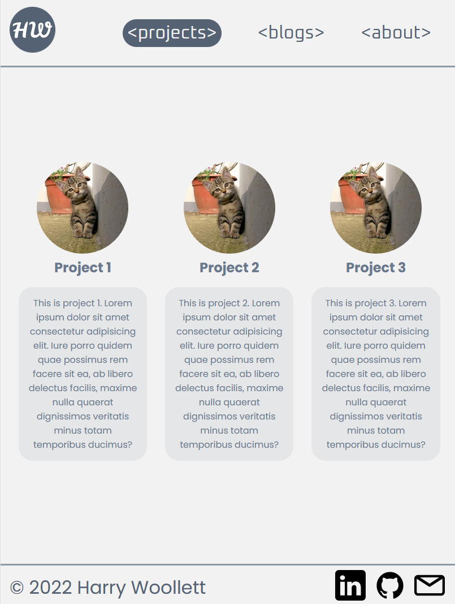
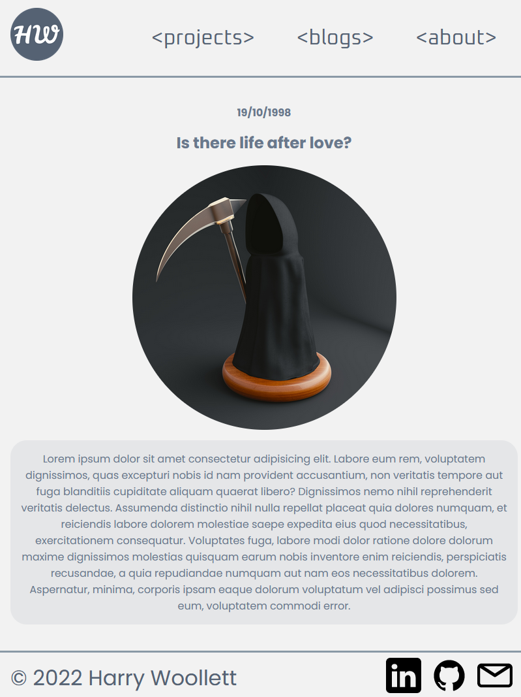
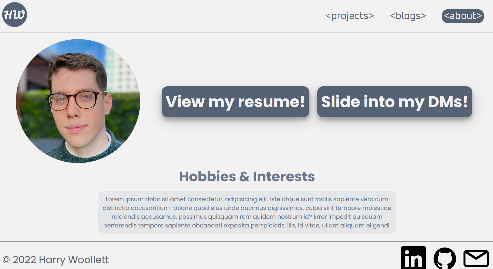

# T1A2 - Portfolio
## Harry Woollett

[Website link](https://silver-dusk-542a48.netlify.app/)

[Github Repository](https://github.com/2-Can/HarryWoollett_T1A2)

---

## Purpose

The purpose of my portfolio website is to showcase my skills as a web designer, as well as display some of my personal brand. It includes contact information, links to my projects & blogs, and a bit of flair.

---

## Features & Functionality

The website has been built with a clean and contemporary design, utilising earth tones and soft edges to create an accessible appearance and flow. It includes a navigation bar that links between the main pages, and a footer that holds links to my contact information and social media pages.

The website is fully responsive and adjusts its layout depending on the resolution of the device it is viewed from. Specifically, it adjusts for smartphones, tablets, and larger laptop or desktop monitors.

The Projects page includes screenshots of three of my projects, as well as a brief blurb that describes each one.

The Blogs page is a directory with links to five blogs I have written. It also displays the title, date and header image of each blog to give an indication of each blog's topic.

The About page provides two "call to action" buttons which can be used to view my resume and automatically draft an email to my personal account. It also includes a small description of my hobbies & interests.

---

## Sitemap

---

## Screenshots

### Mobile

### Tablet

### Desktop

---

## Target Audience

The website is designed to viewed by potential employers in the tech industry, however it is easily navigatable for any other interested parties.

---

## Tech Stack

- Figma for wireframing
- HTML & CSS for building the website
- Netlify for deployment